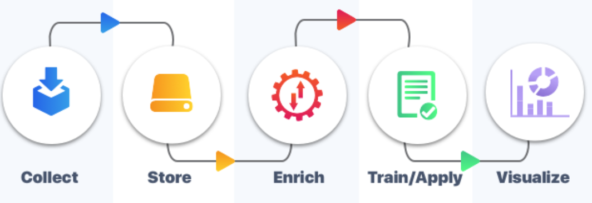
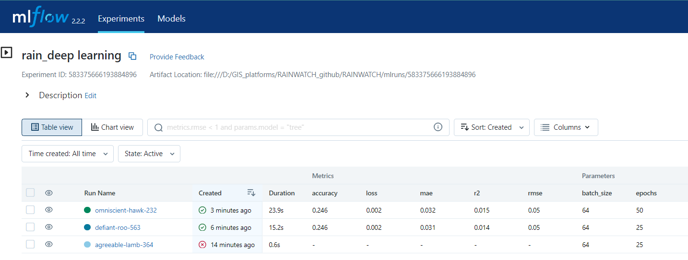

# RAINWATCH : Rainfall analytics and prediction end to end ML project
 
## 1. Project goal 
In this project, we use python to build the back and front ends of a **simple web app for rainfall analytics and prediction** in the United States.
 


## 2. Environment Set Up
We will setup a **conda environment** named rainenv for example with python 3.9 version
```conda create --name rainenv python=3.9``` 
 Then we install via pip libraries such as pandas, numpy , dash, mlflow, tensorflow and sklearn etc . The requirements.txt file in this repository gives the complete list of set up requirements :
  

To install everything needed use the following command : 
```pip install -r requirements.txt```

## 3. Understanding the Prediction problem 
we want to **forecast is the level of precipitation in inches on a given date at given US City**.
**Time series data is data collected on the same subject at different points in time**. Thus, in time series forecasting one must pay attention to the time sequence and other time sensistive aspects : trends, seasonality, etc.. 

To answer this problem, We have an open source Machine Learning pipeline with the following schema :
  

## 4. Collecting data

Data collected for United States meterological stations on a limited time range. The main raw data is weather.csv in data folder.  Here the independent variable is precipitation in inches. The data has **natural dependent variables** like **wind speed, wind direction, average temperature,etc**.

## 5. Storing and enriching the data 

For the moment, there is no storage system. The input csvs are processed in pandas dataframes and used directly. We can easily add an SQL database for intermediate storage.

we enrich the original rainfall statistics with location data (longitude, latitude) from map_cities.csv. This in order to use geolocalisation graphs on the webapp. 

## 6.Training and Tracking 

Use the training scripts in the root folder. With **classic_ML_train.py** you have options of non deep learning models like linear regression, XGBRegressor  etc... The **deep_ML_train.py** presents different architectures of neural networks. All models are imported to the training scripts. Afterwards, trained models are saved in pickle format in **models** format
  

**We monitor the training runs with MLFlow.** In MLFLow, A machine learning experiment contains multiple runs. Each run attempts to answer the prediction problem by minimizing a loss metric. To have standardized, comparable runs, the loss metric in one experiment stays the same. Thus, **the importance of choosing the appropriate metric for our specific prediction problem.**

  

## 7. Deductions from ML experiments


## 8. Improvements

There are potential improvements & contributions at every aspect of the pipeline :

* **DATA** : Apply the template on Algeria data. 
* **STORAGE** : Create an SQL storage for input data. This to enable SQL querys, important to check data status or update or enrich data easily. 

* **MACHINE LEARNING** : Use other libraries and methods to optimize the results 

* **DEPLOYMENT** Use Gunicorn and host like Heroku or Render to deploy the web app online

 